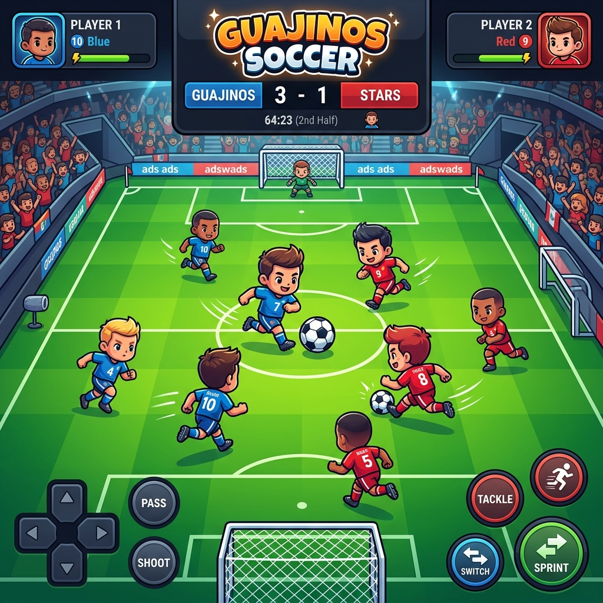
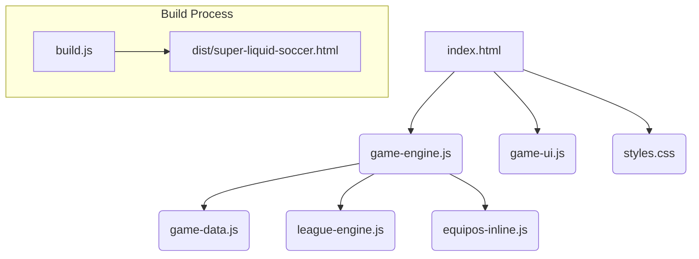
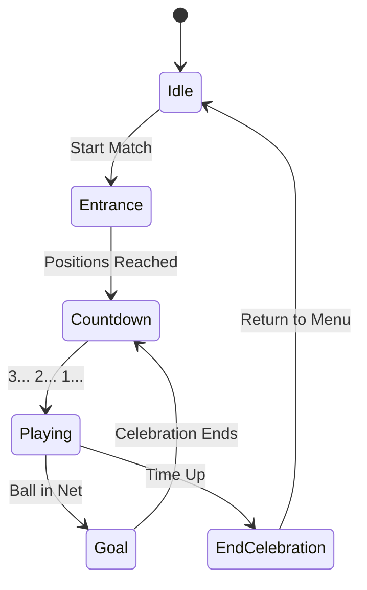

# ⚽ Guajinos Soccer



**Guajinos Soccer** es un simulador de fútbol base (fútbol 7) diseñado para ofrecer una experiencia arcade rápida, divertida y visualmente atractiva. Controla a equipos de la liga infantil asturiana en emocionantes partidos 2D con una estética "baby" única.

---

## 🌟 Características Principales

- **🎮 Jugabilidad Arcade**: Controles sencillos (WASD/Flechas + Espacio) optimizados tanto para PC como para dispositivos móviles.
- **👶 Estética Baby**: Jugadores cabezones y divertidos con animaciones fluidas y expresiones dinámicas (¡lloran si pierden!).
- **🎵 Experiencia Inmersiva**: Música de ambiente durante el partido y sonidos de gol personalizados, todo integrado sin dependencias externas.
- **🏆 Modo Liga**: Compite en la liga infantil asturiana, sigue la clasificación y lucha por el Pichichi o el Zamora.
- **📱 PWA Ready**: Instalable en dispositivos móviles para jugar a pantalla completa y sin conexión.
- **📦 Single File Build**: Proceso de build avanzado que genera un único archivo HTML con todos los assets (imágenes y audio) embebidos en Base64.

---

## 🛠️ Stack Tecnológico


---

## 🏗️ Estructura del Proyecto



---

## 🚀 Cómo Empezar

### Desarrollo
Para jugar en modo desarrollo, simplemente abre `index.html` en tu navegador favorito. Asegúrate de tener los archivos de `musica/` y `escudos/` en sus respectivas carpetas.

### Construcción (Build)
Si deseas generar la versión optimizada en un solo archivo:

1. Instala las dependencias de desarrollo:
   ```bash
   npm install
   ```
2. Ejecuta el script de build:
   ```bash
   npm run build
   ```
3. El resultado estará en `dist/super-liquid-soccer.html`.

---

## 🕹️ Controles

| Acción | PC (Teclado) | Móvil (Touch) |
| :--- | :--- | :--- |
| **Moverse** | `WASD` o `Flechas` | Joystick Virtual (Izquierda) |
| **Pasar** | `Espacio` (toque) | Tap en Pantalla (Derecha) |
| **Tirar** | `Espacio` (mantener) | Hold en Pantalla (Derecha) |
| **Cambiar Jugador** | Automático / Toque | Tap (Derecha) |

---

## 📈 Estados del Juego



---

## 📄 Licencia

Este proyecto es para uso personal y educativo. Todos los derechos reservados.
